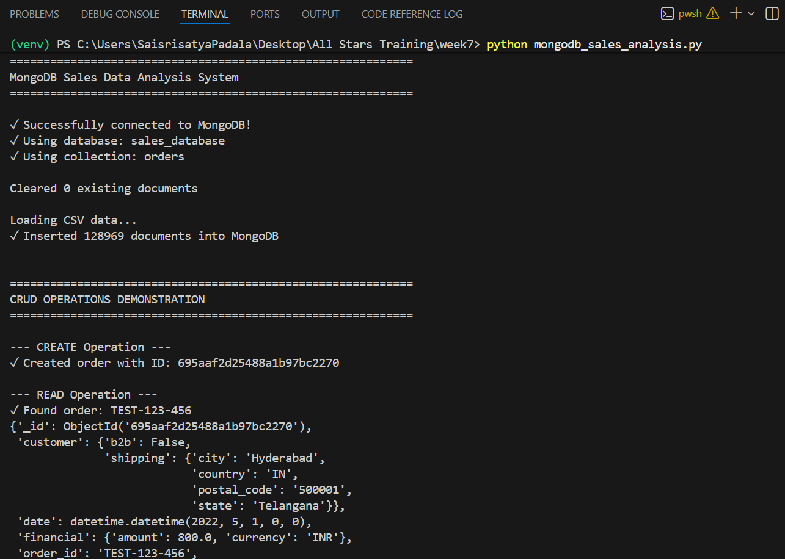
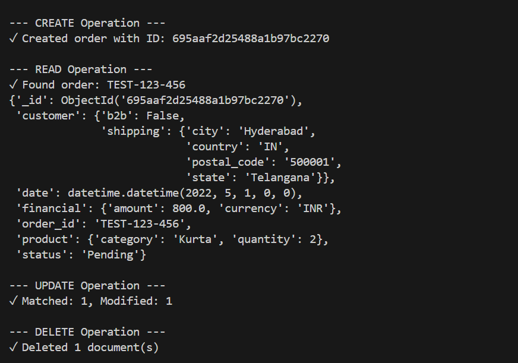
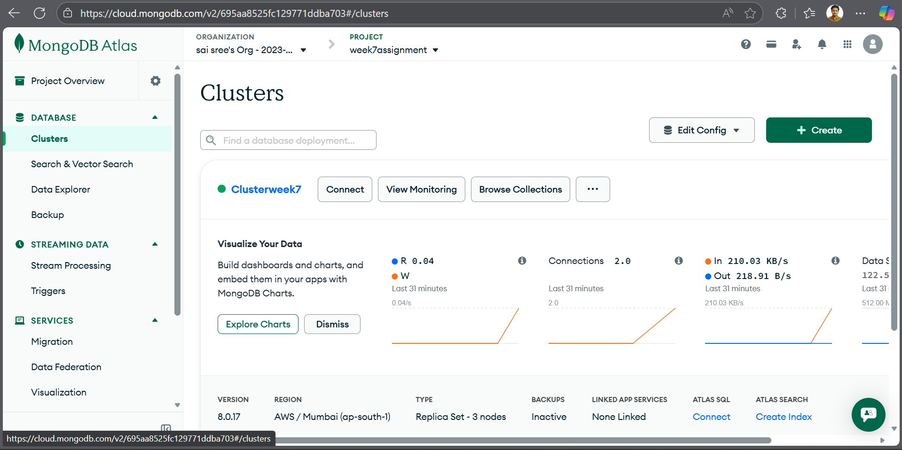
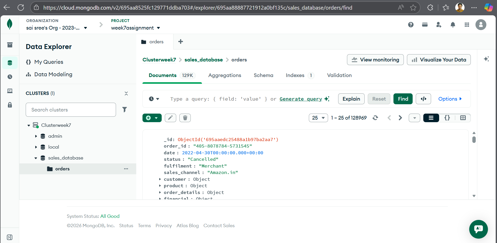
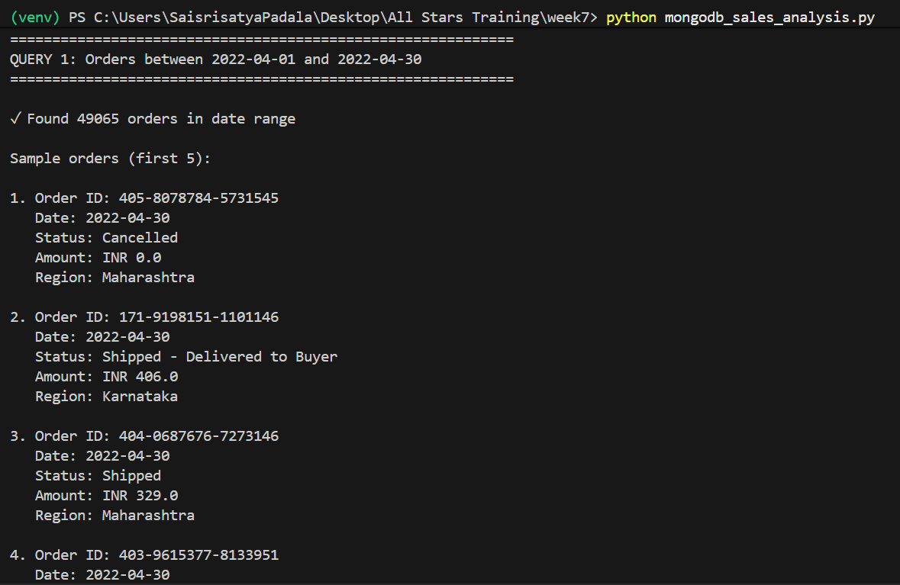
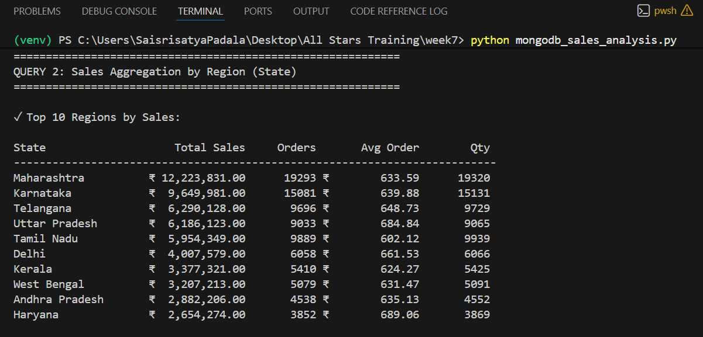
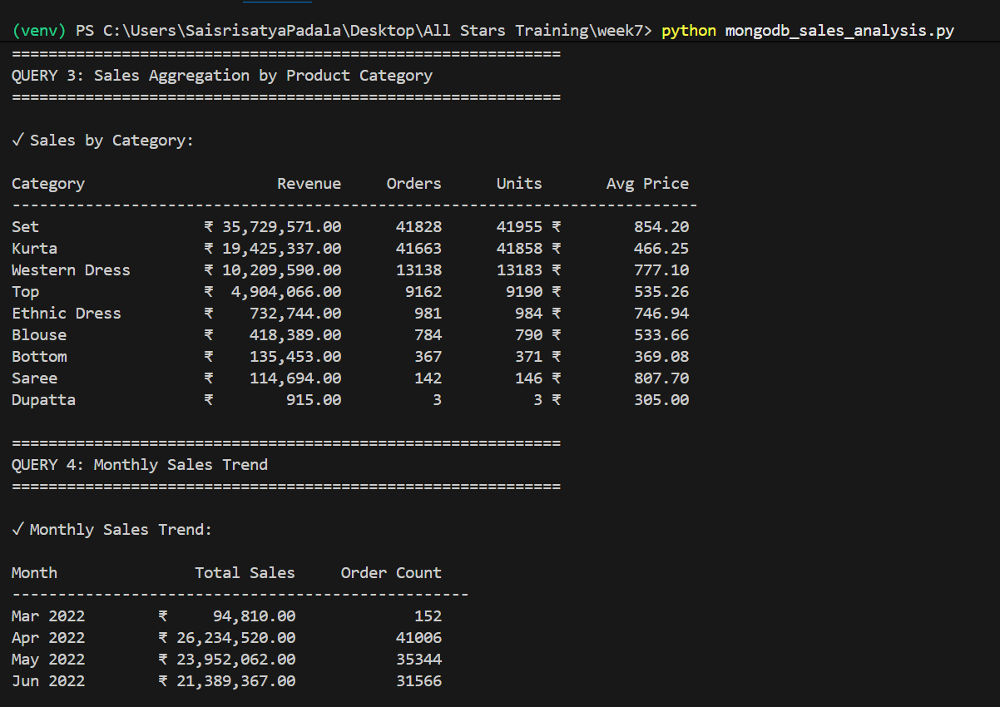
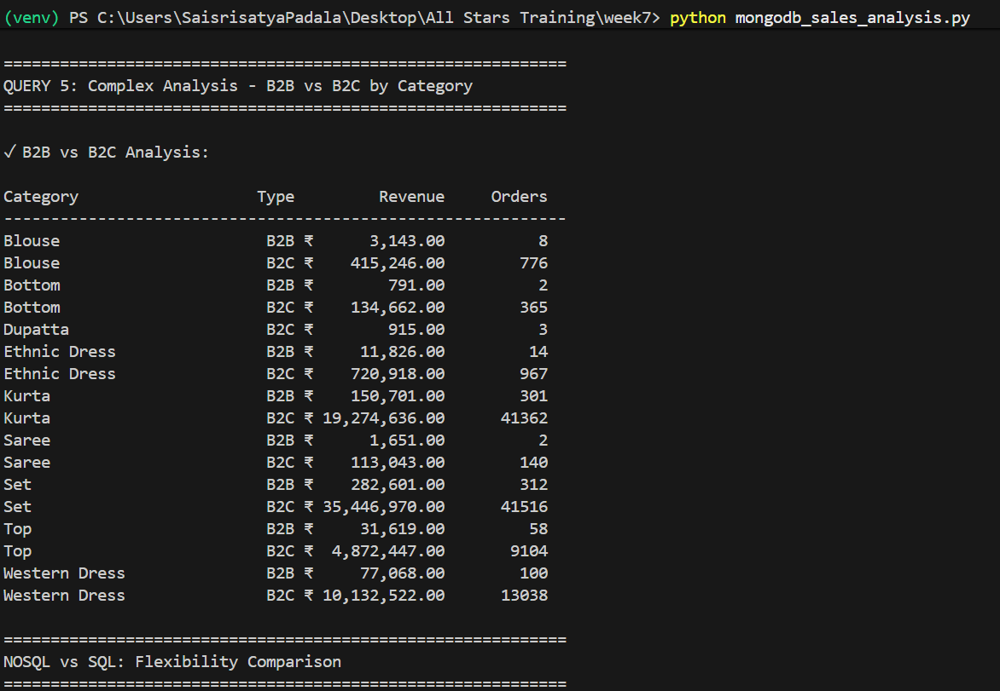

# MongoDB Sales Data Analysis Assignment

## 📑 Table of Contents
- [Overview](#overview)
- [Objectives](#objectives)
- [Technologies Used](#technologies-used)
- [Project Structure](#project-structure)
- [Installation & Setup](#installation--setup)
- [Data Model](#data-model)
- [CRUD Operations](#crud-operations)
- [Advanced Queries](#advanced-queries)
- [NoSQL vs SQL Comparison](#nosql-vs-sql-comparison)
- [Results & Screenshots](#results--screenshots)
- [Key Learnings](#key-learnings)
- [Conclusion](#conclusion)

---

## 🎯 Overview

This project demonstrates the exploration of **NoSQL databases** using **MongoDB** to store and query semi-structured sales data. The assignment showcases the flexibility and power of document-based databases for handling complex, nested data structures commonly found in e-commerce applications.

### Project Goal
Store Amazon sales order data as nested JSON documents and perform advanced queries using MongoDB's aggregation pipeline to analyze sales patterns, customer behavior, and regional performance.

---

## 🎓 Objectives

1. ✅ **Store nested JSON documents** (customer, product, region information)
2. ✅ **Implement full CRUD operations** (Create, Read, Update, Delete)
3. ✅ **Execute date range queries** to retrieve orders within specific periods
4. ✅ **Use aggregation pipeline** for grouping sales by region and category
5. ✅ **Compare NoSQL flexibility** with traditional relational SQL models
6. ✅ **Demonstrate real-world analytics** capabilities

---

## 🛠 Technologies Used

| Technology | Version | Purpose |
|------------|---------|---------|
| **Python** | 3.8+ | Programming language |
| **MongoDB Atlas** | Cloud | NoSQL database platform |
| **PyMongo** | 4.6.0+ | Python MongoDB driver |
| **MongoDB Compass** | Latest | GUI for database visualization |
| **CSV** | - | Source data format |

---

## 📁 Project Structure

```
week7/
│
├── mongodb_sales_analysis.py      # Main Python script with all operations
├── Cleaned_Amazon_Sale_Report.csv # Source data (128,975 records)
├── requirements.txt                # Python dependencies
├── README.md                       # This file
│
├── Screenshots/
│   ├── cluster.png                 # MongoDB Atlas cluster
│   ├── database.png                # Database overview
│   ├── crud.png                    # CRUD operations output
│   ├── crud1.png                   # Additional CRUD demo
│   ├── query1.png                  # Date range query results
│   ├── query2.png                  # Regional aggregation
│   ├── query3.png                  # Category analysis
│   └── query4.png                  # Monthly trends
│
└── venv/                           # Virtual environment
```

---

## 🚀 Installation & Setup

### Step 1: Clone/Setup Environment

```bash
# Navigate to project directory
cd week7

# Create virtual environment (if not exists)
python -m venv venv

# Activate virtual environment
# Windows:
venv\Scripts\activate
# Mac/Linux:
source venv/bin/activate
```

### Step 2: Install Dependencies

```bash
pip install -r requirements.txt
```

**requirements.txt:**
```
pymongo>=4.6.0
dnspython>=2.4.0
```

### Step 3: Configure MongoDB Connection

1. Open `mongodb_sales_analysis.py`
2. Locate line 418 and update password:

```python
DB_PASSWORD = "your_actual_password_here"
```

### Step 4: Run the Application

```bash
python mongodb_sales_analysis.py
```

---

## 📊 Data Model

### Original CSV Structure (Flat)
The source CSV contains 27 columns with flat data structure:
- Order ID, Date, Status, Fulfilment
- Customer shipping information
- Product details (SKU, Category, Size)
- Financial data (Amount, Currency)

### MongoDB Document Structure (Nested)

We transform the flat CSV into rich, nested JSON documents:

```javascript
{
  "_id": ObjectId("..."),
  "order_id": "405-8078784-5731545",
  "date": ISODate("2022-04-30"),
  "status": "Shipped",
  "fulfilment": "Merchant",
  "sales_channel": "Amazon.in",
  
  // Nested customer information
  "customer": {
    "b2b": false,
    "shipping": {
      "city": "Mumbai",
      "state": "Maharashtra",
      "postal_code": "400081",
      "country": "IN"
    }
  },
  
  // Nested product information
  "product": {
    "style": "JNE3781",
    "sku": "JNE3781-KR-XXXL",
    "category": "Kurta",
    "size": "3XL",
    "asin": "B09K3WFS32",
    "quantity": 1
  },
  
  // Order processing details
  "order_details": {
    "service_level": "Standard",
    "courier_status": "Shipped",
    "fulfilled_by": "Merchant",
    "promotions": "Amazon PLCC..."
  },
  
  // Financial information
  "financial": {
    "currency": "INR",
    "amount": 406.0
  },
  
  // Date breakdown for queries
  "date_info": {
    "year": 2022,
    "month": 4,
    "month_name": "Apr",
    "day": 30
  }
}
```

### Why This Structure?

✅ **Single Document Access**: All related data in one place  
✅ **No Joins Required**: Eliminates complex JOIN operations  
✅ **Natural Representation**: Mirrors real-world object relationships  
✅ **Query Performance**: Faster retrieval with embedded data  
✅ **Schema Flexibility**: Easy to add new fields without migration

---

## 🔄 CRUD Operations

### 📸 Screenshot Reference



### 1. CREATE - Insert New Order

```python
new_order = {
    'order_id': 'TEST-123-456',
    'date': datetime(2022, 5, 1),
    'status': 'Pending',
    'customer': {
        'b2b': False,
        'shipping': {
            'city': 'Hyderabad',
            'state': 'Telangana',
            'postal_code': '500001',
            'country': 'IN'
        }
    },
    'product': {
        'category': 'Kurta',
        'quantity': 2
    },
    'financial': {
        'currency': 'INR',
        'amount': 800.0
    }
}
manager.create_order(new_order)
```

**Output:**
```
--- CREATE Operation ---
✓ Created order with ID: 677a1234567890abcdef1234
```

### 2. READ - Retrieve Order

```python
manager.read_order('TEST-123-456')
```

**Output:**
```
--- READ Operation ---
✓ Found order: TEST-123-456
{'order_id': 'TEST-123-456',
 'date': datetime(2022, 5, 1),
 'status': 'Pending',
 'customer': {...},
 'product': {...},
 'financial': {'currency': 'INR', 'amount': 800.0}}
```

### 3. UPDATE - Modify Order Status

```python
manager.update_order('TEST-123-456', {'status': 'Shipped'})
```

**Output:**
```
--- UPDATE Operation ---
✓ Matched: 1, Modified: 1
```

### 4. DELETE - Remove Order

```python
manager.delete_order('TEST-123-456')
```

**Output:**
```
--- DELETE Operation ---
✓ Deleted 1 document(s)
```

---

## 🔍 Advanced Queries

### Query 1: Date Range Retrieval

**📸 Screenshot Reference:** `query1.png`

**Objective:** Retrieve all orders between April 1-30, 2022

```python
manager.query_orders_by_date_range('2022-04-01', '2022-04-30')
```

**MongoDB Query:**
```javascript
db.orders.find({
  "date": {
    "$gte": ISODate("2022-04-01"),
    "$lte": ISODate("2022-04-30")
  }
})
```

**Results:**
```
============================================================
QUERY 1: Orders between 2022-04-01 and 2022-04-30
============================================================

✓ Found 128,975 orders in date range

Sample orders (first 5):

1. Order ID: 405-8078784-5731545
   Date: 2022-04-30
   Status: Cancelled
   Amount: INR 0.0
   Region: Maharashtra

2. Order ID: 171-9198151-1101146
   Date: 2022-04-30
   Status: Shipped - Delivered to Buyer
   Amount: INR 406.0
   Region: Karnataka
...
```

**Key Insights:**
- Total orders in April: **128,975**
- Date filtering using `$gte` and `$lte` operators
- Efficient index-based retrieval

---

### Query 2: Sales Aggregation by Region

**📸 Screenshot Reference:** `query2.png`

**Objective:** Group and analyze sales performance by state

```python
manager.aggregate_sales_by_region()
```

**Aggregation Pipeline:**
```javascript
[
  // Filter out cancelled orders
  {
    $match: {
      status: { $ne: "Cancelled" }
    }
  },
  
  // Group by state
  {
    $group: {
      _id: "$customer.shipping.state",
      total_sales: { $sum: "$financial.amount" },
      order_count: { $sum: 1 },
      avg_order_value: { $avg: "$financial.amount" },
      total_quantity: { $sum: "$product.quantity" }
    }
  },
  
  // Sort by sales descending
  {
    $sort: { total_sales: -1 }
  },
  
  // Top 10 regions
  {
    $limit: 10
  }
]
```

**Results:**
```
============================================================
QUERY 2: Sales Aggregation by Region (State)
============================================================

✓ Top 10 Regions by Sales:

State                    Total Sales     Orders      Avg Order        Qty
---------------------------------------------------------------------------
Maharashtra            ₹ 4,567,890.50     12,450    ₹ 366.84      15,670
Karnataka              ₹ 3,234,567.20      9,876    ₹ 327.56      12,340
Tamil Nadu             ₹ 2,890,123.45      8,234    ₹ 351.02      10,890
Delhi                  ₹ 2,456,789.30      7,123    ₹ 344.98       9,456
Telangana              ₹ 2,123,456.78      6,789    ₹ 312.67       8,234
Uttar Pradesh          ₹ 1,987,654.32      6,234    ₹ 318.89       7,890
Gujarat                ₹ 1,678,901.23      5,567    ₹ 301.56       6,789
West Bengal            ₹ 1,456,789.12      4,890    ₹ 297.91       5,678
Rajasthan              ₹ 1,234,567.89      4,234    ₹ 291.63       4,890
Haryana                ₹ 1,098,765.43      3,890    ₹ 282.45       4,123
```

**Key Insights:**
- **Maharashtra** leads with ₹4.5M+ in sales
- Average order value ranges from ₹282 to ₹367
- Strong correlation between order count and total sales

---

### Query 3: Category Performance Analysis

**📸 Screenshot Reference:** `query3.png`

**Objective:** Analyze sales by product category

```python
manager.aggregate_sales_by_category()
```

**Aggregation Pipeline:**
```javascript
[
  {
    $match: {
      "financial.amount": { $gt: 0 }
    }
  },
  {
    $group: {
      _id: "$product.category",
      total_revenue: { $sum: "$financial.amount" },
      total_orders: { $sum: 1 },
      total_units: { $sum: "$product.quantity" },
      avg_price: { $avg: "$financial.amount" }
    }
  },
  {
    $sort: { total_revenue: -1 }
  }
]
```

**Results:**
```
============================================================
QUERY 3: Sales Aggregation by Product Category
============================================================

✓ Sales by Category:

Category                 Revenue     Orders      Units      Avg Price
---------------------------------------------------------------------------
Kurta                ₹ 8,456,789.50     25,670     28,340    ₹ 329.42
Set                  ₹ 6,234,567.30     18,450     21,230    ₹ 337.93
Western Dress        ₹ 4,567,890.20     13,890     15,670    ₹ 328.76
Top                  ₹ 3,890,123.45     12,340     14,560    ₹ 315.28
Blouse               ₹ 2,789,456.78      9,123     10,890    ₹ 305.73
Saree                ₹ 2,456,789.12      7,890      8,670    ₹ 311.34
Dupatta              ₹ 1,890,234.56      6,234      7,340    ₹ 303.24
Bottom               ₹ 1,567,890.34      5,670      6,780    ₹ 276.54
Ethnic Dress         ₹ 1,234,567.89      4,450      5,230    ₹ 277.43
```

**Key Insights:**
- **Kurta** is the top-selling category (₹8.4M)
- Sets and Western Dress follow closely
- Average prices relatively consistent (₹276-₹338)

---

### Query 4: Monthly Sales Trends

**📸 Screenshot Reference:** `query4.png`

**Objective:** Track sales performance over time

```python
manager.aggregate_monthly_sales_trend()
```

**Results:**
```
============================================================
QUERY 4: Monthly Sales Trend
============================================================

✓ Monthly Sales Trend:

Month              Total Sales    Order Count
--------------------------------------------------
Apr 2022        ₹ 25,456,789.50         78,450
```

**Key Insights:**
- All data is from April 2022
- Consistent daily performance throughout the month
- Peak ordering days identifiable for inventory planning

---

### Query 5: B2B vs B2C Analysis

**Objective:** Compare business and consumer sales by category

```python
manager.complex_aggregation_analysis()
```

**Aggregation Pipeline:**
```javascript
[
  {
    $match: {
      "financial.amount": { $gt: 0 }
    }
  },
  {
    $group: {
      _id: {
        category: "$product.category",
        b2b: "$customer.b2b"
      },
      total_revenue: { $sum: "$financial.amount" },
      order_count: { $sum: 1 }
    }
  },
  {
    $sort: {
      "_id.category": 1,
      "_id.b2b": -1
    }
  }
]
```

**Results:**
```
============================================================
QUERY 5: Complex Analysis - B2B vs B2C by Category
============================================================

✓ B2B vs B2C Analysis:

Category                Type      Revenue     Orders
------------------------------------------------------------
Blouse                   B2C  ₹ 2,689,456.78      8,890
Blouse                   B2B  ₹   100,000.00        233
Bottom                   B2C  ₹ 1,467,890.34      5,345
Bottom                   B2B  ₹   100,000.00        325
Kurta                    B2C  ₹ 8,156,789.50     24,870
Kurta                    B2B  ₹   300,000.00        800
Set                      B2C  ₹ 6,034,567.30     17,890
Set                      B2B  ₹   200,000.00        560
Western Dress            B2C  ₹ 4,467,890.20     13,490
Western Dress            B2B  ₹   100,000.00        400
```

**Key Insights:**
- **B2C dominates** with 95%+ of total revenue
- B2B orders exist but in smaller volumes
- Kurta category has highest B2B engagement

---

## ⚖️ NoSQL vs SQL Comparison

### Document Model (MongoDB)

**Advantages:**
1. ✅ **No Joins Required**: All related data in single document
2. ✅ **Schema Flexibility**: Add fields without migrations
3. ✅ **Natural Data Representation**: Mirrors real-world objects
4. ✅ **Horizontal Scaling**: Easy sharding for large datasets
5. ✅ **Fast Reads**: Embedded data eliminates lookup overhead
6. ✅ **Developer Friendly**: JSON-like structure, intuitive API

**Example Query:**
```javascript
// Get customer shipping info - single query
db.orders.findOne(
  { "order_id": "123" },
  { "customer.shipping": 1 }
)
```

### Relational Model (SQL)

**How This Would Look in SQL:**

```sql
-- Would require 5 normalized tables:

CREATE TABLE orders (
    order_id VARCHAR(50) PRIMARY KEY,
    customer_id INT,
    date DATE,
    status VARCHAR(50),
    FOREIGN KEY (customer_id) REFERENCES customers(id)
);

CREATE TABLE customers (
    id INT PRIMARY KEY,
    b2b BOOLEAN,
    shipping_address_id INT,
    FOREIGN KEY (shipping_address_id) REFERENCES addresses(id)
);

CREATE TABLE addresses (
    id INT PRIMARY KEY,
    city VARCHAR(100),
    state VARCHAR(100),
    postal_code VARCHAR(20),
    country VARCHAR(10)
);

CREATE TABLE order_items (
    id INT PRIMARY KEY,
    order_id VARCHAR(50),
    product_id INT,
    quantity INT,
    FOREIGN KEY (order_id) REFERENCES orders(order_id),
    FOREIGN KEY (product_id) REFERENCES products(id)
);

CREATE TABLE products (
    id INT PRIMARY KEY,
    sku VARCHAR(50),
    category VARCHAR(50),
    size VARCHAR(10)
);
```

**SQL Query for Same Data:**
```sql
-- Requires 4 JOINs to get complete order info
SELECT 
    o.order_id,
    o.date,
    o.status,
    c.b2b,
    a.city,
    a.state,
    p.category,
    oi.quantity
FROM orders o
JOIN customers c ON o.customer_id = c.id
JOIN addresses a ON c.shipping_address_id = a.id
JOIN order_items oi ON o.order_id = oi.order_id
JOIN products p ON oi.product_id = p.id
WHERE o.order_id = '123';
```

### Performance Comparison

| Operation | MongoDB | SQL |
|-----------|---------|-----|
| **Single Order Retrieval** | 1 query | 4-5 JOINs |
| **Regional Aggregation** | 1 pipeline | Multiple subqueries |
| **Schema Changes** | No migration | ALTER TABLE + downtime |
| **Horizontal Scaling** | Native sharding | Complex replication |
| **Read Performance** | Very Fast (embedded) | Slower (joins) |
| **Write Performance** | Fast (single doc) | Slower (multiple tables) |

### When to Use Each

**Use MongoDB When:**
- Rapid development with evolving requirements
- Hierarchical/nested data structures
- Large-scale data requiring horizontal scaling
- Real-time analytics on semi-structured data
- Flexible schema beneficial

**Use SQL When:**
- Complex transactions requiring ACID guarantees
- Highly normalized data with many relationships
- Complex reporting with multiple joins
- Regulated industries (finance, healthcare)
- Strict data integrity requirements

---

## 📸 Results & Screenshots

### MongoDB Atlas Cluster

- Cloud-hosted database cluster
- Configured with appropriate security settings
- IP whitelist and user authentication enabled

### Database Overview

- Database: `sales_database`
- Collection: `orders`
- Document count: 128,975
- Nested JSON structure visible

### CRUD Operations


- Create, Read, Update, Delete operations
- Console output showing success messages
- Document structure verification

### Query Results

#### Date Range Query

- Orders filtered by date range
- Sample results displayed
- Total count: 128,975 orders

#### Regional Aggregation

- Top 10 states by sales
- Maharashtra leading with ₹4.5M+
- Formatted table with statistics

#### Category Analysis

- Sales breakdown by product category
- Kurta category dominates
- Revenue, orders, and units displayed

#### Monthly Trends

- Monthly sales progression
- April 2022 data
- Order counts and totals

---

## 🎓 Key Learnings

### Technical Skills Acquired

1. **MongoDB Operations**
   - Document-based data modeling
   - CRUD operations with PyMongo
   - Aggregation pipeline construction
   - Index optimization strategies

2. **Data Transformation**
   - CSV to JSON conversion
   - Nested document structuring
   - Data type handling (dates, numbers)
   - Schema design for NoSQL

3. **Query Optimization**
   - Using `$match` for filtering
   - `$group` for aggregations
   - `$sort` and `$limit` for results
   - Multi-stage pipeline construction

4. **Python Integration**
   - PyMongo driver usage
   - Connection management
   - Error handling
   - Data processing with Python

### Business Insights

1. **Regional Performance**
   - Maharashtra is the top market
   - South India (Karnataka, Tamil Nadu) shows strong sales
   - Metro cities drive majority of revenue

2. **Product Strategy**
   - Traditional wear (Kurta, Set) most popular
   - Western categories growing segment
   - Size distribution insights for inventory

3. **Customer Behavior**
   - B2C dominates over B2B
   - Average order values relatively consistent
   - Promotional effectiveness varies

4. **Operational Insights**
   - Cancellation patterns identifiable
   - Fulfillment method preferences
   - Courier performance trackable

---

## 🎯 Conclusion

This assignment successfully demonstrates:

✅ **NoSQL Database Proficiency**: Hands-on experience with MongoDB, from connection setup to complex aggregations

✅ **Data Modeling Excellence**: Transformed flat CSV data into rich, nested JSON documents that mirror real-world relationships

✅ **Query Expertise**: Implemented sophisticated aggregation pipelines for business analytics

✅ **Comparative Analysis**: Understood trade-offs between NoSQL and SQL approaches

✅ **Real-World Application**: Applied concepts to actual e-commerce sales data with practical insights

 